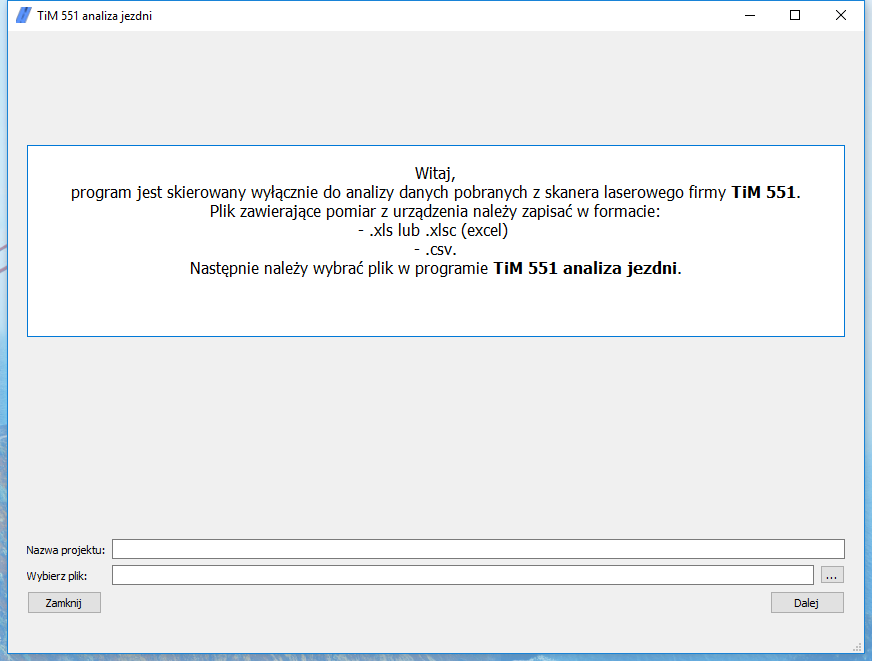
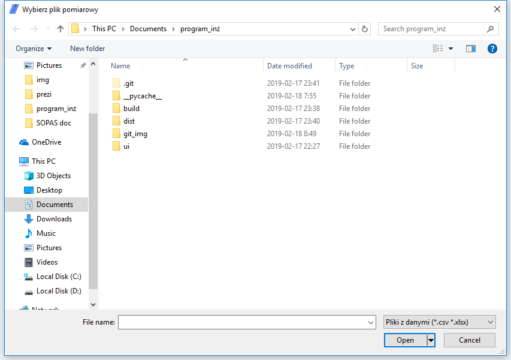
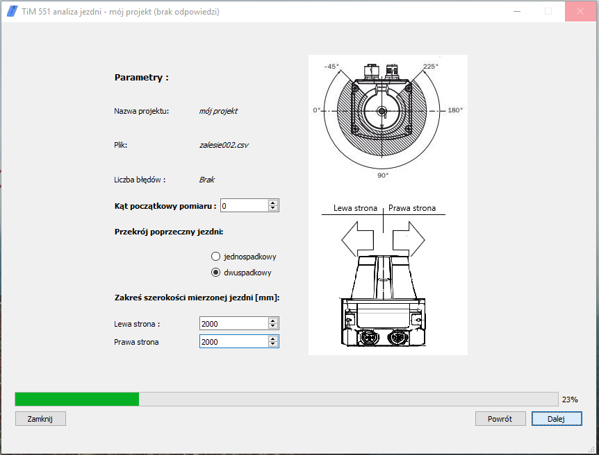
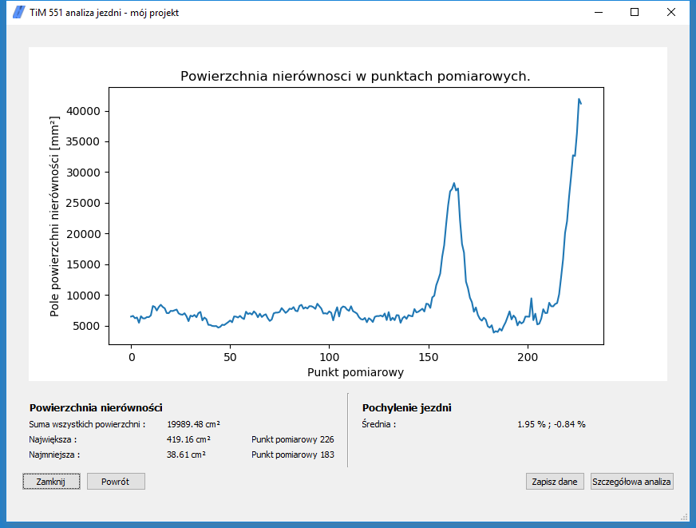
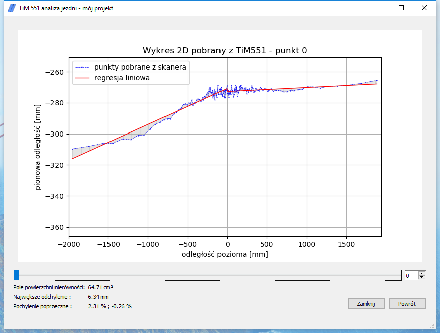
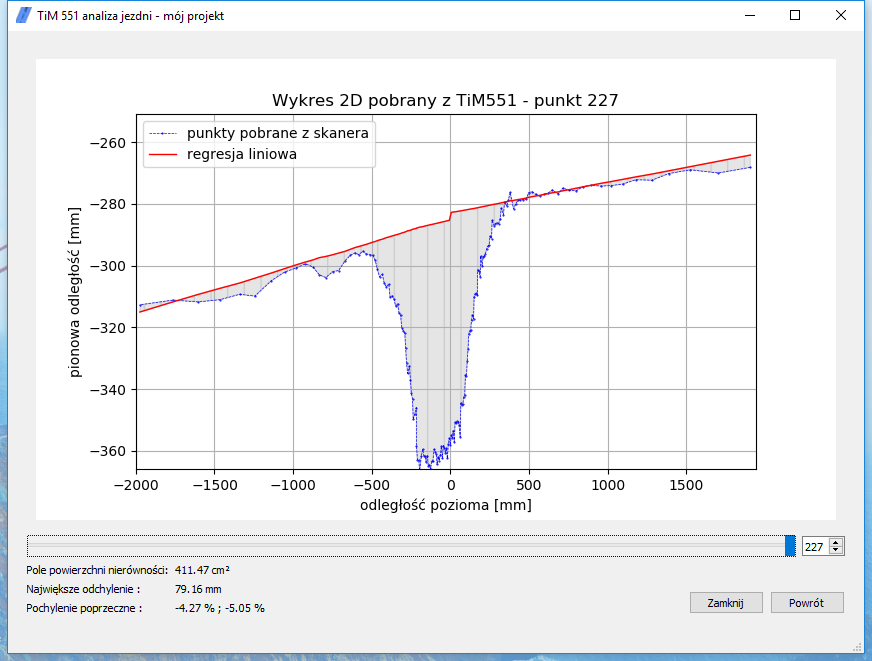
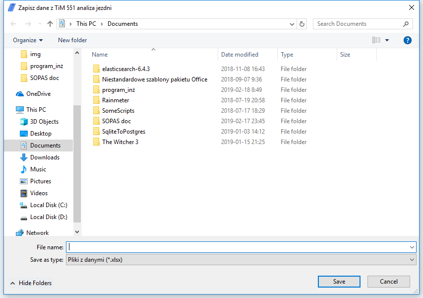

<h3>Data-Analysis</h3>

<h4>Analysis data in python.</h4>

Used packeges:
<ul>
    <li>numpy</li>
    <li>pandas</li>
    <li>matplotlib</li>
    <li>scikit-learn</li>
    <li>PyQt5</li>
    <li>pyinstaller</li>
</ul>
All code was tested Jupyter notebook.
 

 
<u>Preview</u>:  
 
Program is created for Civil Engineers to analyze roadway.
Main goal is to process data from a <a href="https://www.sick.com/us/en/detection-and-ranging-solutions/2d-lidar-sensors/tim5xx/tim551-2050001/p/p343045">laser scaner TiM 551</a>.
All information that we need to get are compute in SOPAS engeenring tool and save in csv or excel file.
File generete from SOPAS contain state device during measure and data of measure.
Data from device looks :
  
<table border="1" style="margin-left:15px">
    <tr>
        <td></td>
        <td>Angle1</td>
        <td>Angle2</td>
        <td>Angle[..]</td>
    </tr>
    <tr>
        <td>measure1</td>
        <td>distance1_1</td>
        <td>distance1_2</td>
        <td>distance1_[..]</td>
    </tr>
    <tr>
        <td>measure2</td>
        <td>distance2_1</td>
        <td>distance2_2</td>
        <td>distance2_[..]</td>
    </tr>
</table>

 
<u>Program features</u>:  
 
<ul>
    <li>reading data</li>
    <li>cleaning and preparation data</li>
    <li>data processing</li>
    <li>data aggregation and operations performed on groups</li>
    <li>graphs and data visualization</li>
    <li>saving calculated data</li>
</ul>
 

 
<h5><u>Graphical user interface with functionality</u></h5>:  
 

<ul>
    <li>
        
Setting name of project and select data file 

    </li>
</ul>

 

<ul>
    <li>
        
Reading file with specified data (condatain validation)

    </li>
</ul>

 

<ul>
    <li>
        
Setting parameters 

    </li>
</ul>

 

<ul>
    <li>
        
Display calculated road unevenness area

    </li>
</ul>

 

<ul>
    <li>
        
Detailed 2D shape of roadway with regression (calculated coef of road)

    </li>

</ul>

 

<ul>
    <li>
        
Interpolated shape of regression in places of holes

    </li>
</ul>

 

<ul>
    <li>
        
Option to save most important calculated data

    </li>
</ul>

 

  
<em>If You want to check functionallity of TiM 551 road analyze, download "sample_data.xlsx" and run 'dist/gui.exe'. Parameters to set up like on images above.</em>
 

Thanks for reading, and have fun.

